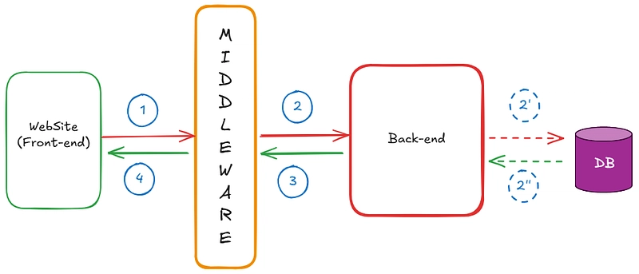

<p align="center">
  
</p>

<div align="center">

[](#)
[](https://python.org)
[](https://developer.mozilla.org)

**Sistem pengelolaan dokumen terintegrasi yang memisahkan logika backend yang kuat dengan interface frontend yang responsif.**

</div>

---

## 🔄 Alur Kerja Aplikasi
<p align="center">
  
</p>

---

## 📑 Mengenai Proyek
**MyDocument App** dirancang dengan arsitektur *decoupled*. Backend menangani pemrosesan teks berat, pembersihan data (*text cleaning*), dan interaksi database, sementara Frontend fokus pada pengalaman pengguna yang intuitif.


---

## 📂 Struktur Proyek (Architecture)
Proyek ini terbagi menjadi dua folder utama untuk menjaga kode tetap bersih dan mudah dikembangkan:

```bash
mydocument/
├── ⚙️ backend/                # Core Logic & Data Processing
│   ├── generator.py          # Modul pemrosesan dokumen & text cleaning
│   ├── main.py               # Entry point API (Flask/FastAPI)
│   ├── models.py             # Definisi skema database & struktur data
│   └── 🗄️ database/           # Folder khusus penyimpanan SQLite
│
└── 🎨 frontend/               # User Interface & Interaction
    ├── index.html            # Struktur utama halaman (HTML5)
    ├── style.css             # Desain visual & layouting (CSS3)
    └── app.js                # Logic sisi klien & Fetch API (JS)
